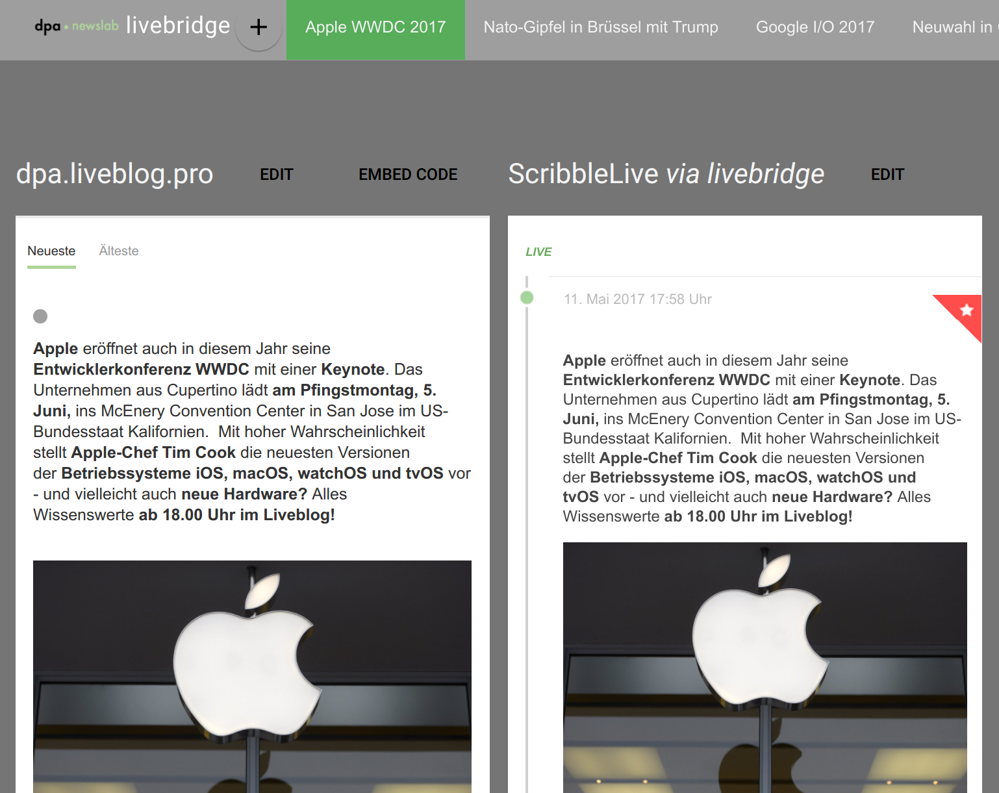

# livebridge-viewer

## in `html`:

A tiny HTML app that shows what [livebridge](https://github.com/dpa-newslab/livebridge/) is doing. It specializes in displaying ScribbleLive and Liveblog streams side-by-side and is currently not really good for anything else.

## in `bin` :

Scripts to generat the JSON needed for the HTML app from a `config.yml` file provided to a [livebridge](https:://github.com/dpa-newslab/livebridge) instance.

